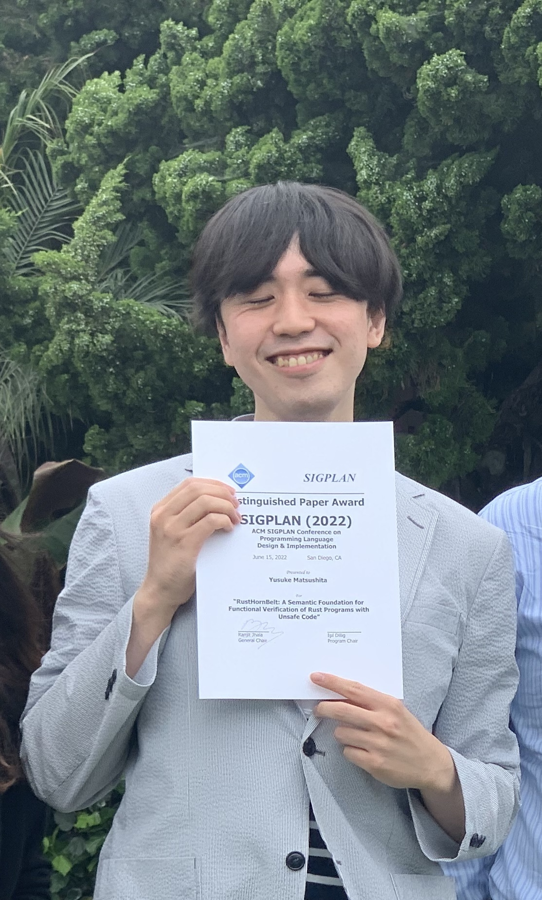

% Yusuke MATSUSHITA (松下 祐介)

# Yusuke MATSUSHITA <small>(松下 祐介)</small>

{ width=150px } \

(Last updated: Apr 7, 2025)

I am a software scientist working as a Program-Specific Assistant Professor at
  [the Hakubi Center for Advanced Research](https://www.hakubi.kyoto-u.ac.jp/eng)
  and [the Graduate School of Informatics](https://www.i.kyoto-u.ac.jp/en/),
  [Kyoto University](https://www.kyoto-u.ac.jp/en). \
I specialize in formal verification of stateful programs, especially those
  written in [Rust](https://www.rust-lang.org/) (e.g., my work
  [RustHorn](#rusthorn), [RustHornBelt](#rusthornbelt), and [Nola](#nola)). I am
  also curious about many other topics, including algorithms and natural
  language processing (e.g., [SoftMatcha](#softmatcha)).

[Google Scholar](https://scholar.google.com/citations?user=wd4nXRQAAAAJ),
  [dblp](https://dblp.uni-trier.de/pers/hd/m/Matsushita_0002:Yusuke),
  [ORCID](https://orcid.org/0000-0002-5208-3106),
  [researchmap](https://researchmap.jp/y.matsushita) \
[GitHub](https://github.com/shiatsumat),
  [Twitter](https://twitter.com/shiatsumat),
  [LinkedIn](https://www.linkedin.com/in/yusuke-matsushita-2748b11a1/) \
Email: ysk.m24t@gmail.com

[Curriculum Vitae](./cv/yusuke-matsushita-cv.pdf) (Last updated: Apr 5, 2025)

## Papers

- [_Yusuke Matsushita_ and Takeshi Tsukada. \
  __Nola__: Later-Free Ghost State for Verifying Termination in Iris.]{#nola} \
  [__PLDI 2025__](https://pldi25.sigplan.org/). June 16-20, 2025. \
  Paper: [Authors'](./papers/pldi2025-nola.pdf). \
  Rocq artifact: [GitHub](https://github.com/hopv/nola),
    [Zenodo](https://doi.org/10.5281/zenodo.15050271).
- [Hiroyuki Deguchi, Go Kamoda, _Yusuke Matsushita_, Chihiro Taguchi, Kohei
    Suenaga, Masaki Waga and Sho Yokoi. \
  __SoftMatcha__: A Soft and Fast Pattern Matcher for Billion-Scale Corpus
    Searches.]{#softmatcha} \
  [__ICLR 2025__](https://iclr.cc/Conferences/2025). Apr 24-28, 2025. \
  [Webpage](https://softmatcha.github.io/),
    [OpenReview](https://openreview.net/forum?id=Q6PAnqYVpo). \
  Paper: [OpenReview](https://openreview.net/pdf?id=Q6PAnqYVpo),
    [arXiv](https://arxiv.org/abs/2503.03703).
- Takashi Nakayama, _Yusuke Matsushita_, Ken Sakayori, Ryosuke Sato and Naoki
    Kobayashi. \
  Borrowable Fractional Ownership Types for Verification. \
  [__VMCAI 2024__](https://popl24.sigplan.org/home/VMCAI-2024). Jan
    15-16, 2024. \
  Paper: [Springer](https://doi.org/10.1007/978-3-031-50521-8_11),
    [arXiv](https://arxiv.org/abs/2310.20430). \
  Talk at [VMCAI 2024](https://popl24.sigplan.org/home/VMCAI-2024):
    [YouTube](https://www.youtube.com/watch?v=fBKjam3PN3U).
- [_Yusuke Matsushita_, Xavier Denis, Jacques-Henri Jourdan and Derek Dreyer. \
  __RustHornBelt__: A Semantic Foundation for Functional Verification of Rust
    Programs with Unsafe Code.]{#rusthornbelt} \
  [__ACM PLDI 2022__](https://pldi22.sigplan.org/). June 13-17, 2022. \
  __Distinguished Paper Award__. \
  Paper: [ACM-DL](https://dl.acm.org/doi/10.1145/3519939.3523704),
    [Authors'](./papers/pldi2022-rusthornbelt.pdf). \
  Artifacts: [Zenodo](https://zenodo.org/record/6501665#.YoycDmBByJE);
    [Rocq mechanization](https://gitlab.mpi-sws.org/iris/lambda-rust/-/tree/masters/rusthornbelt),
    [Benchmarks](https://github.com/xldenis/rhb-specs). \
  Talk at [PLDI 2022](https://pldi22.sigplan.org/):
    [Slides](./talks/pldi2022-rusthornbelt-talk.pdf),
    [YouTube](https://www.youtube.com/watch?v=pOg4dEhr5hI).
- [_Yusuke Matsushita_, Takeshi Tsukada and Naoki Kobayashi. \
  __RustHorn__: CHC-based Verification for Rust Programs.]{#rusthorn} \
  [__ACM TOPLAS__](https://dl.acm.org/toc/toplas/2021/43/4). Oct 31, 2021. \
  Extended version of the same-titled ESOP 2020 paper. \
  Paper: [ACM-DL](https://dl.acm.org/doi/10.1145/3462205),
    [Authors'](./papers/toplas2021-rust-horn.pdf).
- _Yusuke Matsushita_, Takeshi Tsukada and Naoki Kobayashi. \
  __RustHorn__: CHC-based Verification for Rust Programs. \
  [__ESOP 2020__](https://www.etaps.org/2020/esop). Apr 27-29, 2020. \
  __Selected to TOPLAS Special Issue on ESOP 2020__. \
  Paper: [Authors'](./papers/esop2020-rust-horn.pdf),
    [Springer](https://doi.org/10.1007/978-3-030-44914-8_18),
    [arXiv](https://arxiv.org/abs/2002.09002). \
  Talk at [ESOP 2020](https://etaps.org/2021/esop/esop-2020-programme):
    [Slides](./talks/etaps2021-esop2020-rust-horn-talk.pdf)
    ([Keynote](./talks/etaps2021-esop2020-rust-horn-talk.key)),
    [Video](https://www.morressier.com/article/rusthorn-chcbased-verification-rust-programs/604907f41a80aac83ca25d55). \
  Artifacts: [Zenodo](https://zenodo.org/record/4710723),
    [GitHub Repo](https://github.com/hopv/rust-horn).

## Theses

- _Yusuke Matsushita_. \
  Non-Step-Indexed Separation Logic with Invariants and Rust-Style Borrows
    (不変条件と Rust 流の借用を扱える非 Step-Indexed な分離論理). \
  Ph.D. dissertation. University of Tokyo. Supervised by Prof. Naoki Kobayashi.
    Dec 6, 2023. \
  Predecessor of [the Nola paper](#nola). \
  Paper: [Author's](./papers/phd-thesis.pdf). \
  Talk: [Slides](./talks/phd-thesis-talk.pdf)
    ([Keynote](./talks/phd-thesis-talk.key)).
- _Yusuke Matsushita_. \
  Extensible Functional-Correctness Verification of Rust Programs by the
    Technique of Prophecy (預言の技術による Rust プログラムの拡張可能な機能正当性検証). \
  Master's thesis. University of Tokyo. Supervised by Prof. Naoki Kobayashi. Feb
    24, 2021. \
  Predecessor of [the RustHornBelt paper](#rusthornbelt). \
  Paper: [Author's](./papers/masters-thesis.pdf). \
  Talk: [Slides](./talks/masters-thesis-talk.pdf)
    ([Keynote](./talks/masters-thesis-talk.key)).
- _Yusuke Matsushita_. \
  CHC-based Program Verification Exploiting Ownership Types
    (所有権型を利用した CHC ベースのプログラム検証). \
  Senior thesis. University of Tokyo. Supervised by Prof. Naoki Kobayashi. Feb
    28, 2019. \
  Predecessor of [the RustHorn paper](#rusthorn). \
  Paper: [Author's](./papers/senior-thesis.pdf). \
  Talk: [Slides](./talks/senior-thesis-talk.pdf)
    ([Keynote](./talks/senior-thesis-talk.key)).

## Lectures

- _Yusuke Matsushita_. The Fun of Rust. \
  Lecture for the Course of CCE, Grad School of Informatics, Kyoto University.
    Dec 20, 2024. \
  [Slides](./talks/2024-course-talk.pdf)
    ([Keynote](./talks/2024-course-talk.key)),
    [Info](./talks/2024-course-talk.txt).
- _Yusuke Matsushita_. 分離論理 Iris の世界 (The World of the Separation Logic
    Iris). \
  __Invited lecture__ at
    [PPL Summer School 2024](http://ppl.jssst.or.jp/index.php?ss2024). Sept
    9, 2024. \
    [Slides](./talks/ppl-ss-2024-iris-lecture.pdf)
      ([Keynote](./talks/ppl2020-esop2020-rust-horn-talk.key)),
      [YouTube](https://www.youtube.com/watch?v=uqZEJv9wvBA).
- _Yusuke Matsushita_ and Takashi Nakayama.
    ソフトウェアの科学 〜バグのない世界を目指して〜 (Science of Software, Aspiring to a
    World Free of Bugs). \
  Open Campus 2023, the Faculty of Science, the University of Tokyo. Aug
    2, 2023. \
  [Slides](./talks/open-campus-2023-talk.pdf)
    ([Keynote](./talks/open-campus-2023-talk.key)),
    [YouTube](https://www.youtube.com/watch?v=DDdEtx05dZ4).

## Talks

- _Yusuke Matsushita_, Kengo Hirata and Ryo Wakizaka. \
  Concurrent Quantum Separation Logic for Fine-Grained Parallelism. \
  Talk at [TPSA 2025](https://popl25.sigplan.org/home/tpsa-2025). Jan 21, 2025.
    [Extended abstract](./papers/tpsa2025-cqsl.pdf),
    [Slides](./talks/tpsa2025-cqsl-talk.pdf)
    ([Powerpoint](./talks/tpsa2025-cqsl-talk.pptx)). \
  Talk at [PLanQC 2025](https://popl25.sigplan.org/home/planqc-2025) (Presented
    by Ryo Wakizaka). Jan 25, 2025.
    [Extended abstract](./papers/planqc2025-cqsl.pdf),
    [Slides](./talks/planqc2025-cqsl-talk.pdf)
    ([Powerpoint](./talks/planqc2025-cqsl-talk.pptx)).
- _Yusuke Matsushita_. \
  Rust から広がるプログラム検証・テストの新展望 (New Perspectives on Program
    Verification and Testing Spreading from Rust). \
  __Invited talk__ at [PRO-2024-1](https://sigpro.ipsj.or.jp/pro2024-1/). June
    13, 2024. [Slides](./talks/pro-2024-1-invited-talk.pdf)
    ([Keynote](./talks/pro-2024-1-invited-talk.key)).
- _Yusuke Matsushita_, Xavier Denis, Jacques-Henri Jourdan and Derek Dreyer. \
  [RustHornBelt: A Semantic Foundation for Functional Verification of Rust
    Programs with Unsafe Code](#rusthornbelt). PLDI 2022. \
  Talk at [PLDI 2022](https://pldi22.sigplan.org/). June 17, 2022.
    [Slides](./talks/pldi2022-rusthornbelt-talk.pdf),
    [YouTube](https://www.youtube.com/watch?v=pOg4dEhr5hI),
- _Yusuke Matsushita_, Takeshi Tsukada and Naoki Kobayashi. \
  [RustHorn: CHC-based Verification for Rust Programs](#rusthorn). ESOP 2020. \
  Talk at [ESOP 2020](https://etaps.org/2021/esop/esop-2020-programme). Mar 31,
    2021 (delayed due to the pandemic).
    [Slides](./talks/etaps2021-esop2020-rust-horn-talk.pdf)
    ([Keynote](./talks/etaps2021-esop2020-rust-horn-talk.key)),
    [Video](https://www.morressier.com/article/rusthorn-chcbased-verification-rust-programs/604907f41a80aac83ca25d55). \
  __Invited talk__ at [JSSST 2020](https://jssst2020.wordpress.com/). Sept
    10, 2020. [Slides](./talks/jssst2020-esop2020-rust-horn-talk.pdf)
    ([Keynote](./talks/jssst2020-esop2020-rust-horn-talk.key)),
    [YouTube](https://www.youtube.com/watch?v=Ah_Bds6I_YI). \
  Talk at [PPL 2020](https://jssst-ppl.org/workshop/2020/). Mar 4, 2020.
    [Slides](./talks/ppl2020-esop2020-rust-horn-talk.pdf)
    ([Keynote](./talks/ppl2020-esop2020-rust-horn-talk.key)).

### Co-Authored

- Hiroyuki Deguchi, Go Kamoda, _Yusuke Matsushita_, Chihiro Taguchi, Kohei
    Suenaga, Masaki Waga and Sho Yokoi. \
  SoftMatcha: 大規模コーパス検索のための柔らかくも高速なパターンマッチャー (SoftMatcha: A
    Soft and Fast Pattern Matcher for Billion-Scale Corpus Searches). \
  [NLP 2025](https://www.anlp.jp/nlp2025/). Mar 13, 2025. \
  [Paper](https://www.anlp.jp/proceedings/annual_meeting/2025/pdf_dir/P8-20.pdf).
- Hiroyuki Deguchi, Go Kamoda, _Yusuke Matsushita_, Kohei Suenaga, Masaki Waga
    and Sho Yokoi. \
  柔らかいgrep/KWICに向けて：高速単語列マッチングの埋め込み表現による連続化 (Towards Soft
    Grep/KWIC: Making Fast Word Sequence Matching Continuous Using Embedded
    Representations). \
  [YANS 2024](https://yans.anlp.jp/entry/yans2024). Sept 5, 2024. \
  Predecessor of [SoftMatcha](#softmatcha). \
  __Best Demo Award__ and __Award by Recruit Holdings__.

## Posters

- _Yusuke Matsushita_, Yudai Tanabe, Taro Sekiyama and Atsushi Igarashi. \
  Linear Haskell での Rust 流借用の純粋な実現 (Pure Realization of Rust-Style
    Borrows in Linear Haskell). \
  [PPL 2025](https://jssst-ppl.org/workshop/2025/). Mar 5, 2025.
    [PDF](./posters/ppl2025-pure-borrow-poster.pdf)
    ([Keynote](./posters/ppl2025-pure-borrow-poster.key)). \
  __Best Poster Award__.
- _Yusuke Matsushita_, Naoki Kobayashi and Takeshi Tsukada. \
  所有権型を利用した CHC ベースのプログラム検証 (CHC-based Program Verification
    Exploiting Ownership Types). \
  [PPL 2019](https://jssst-ppl.org/workshop/2019/). Mar 6, 2019.
    [PDF](./posters/ppl2019-senior-thesis-poster.pdf)
    ([Keynote](./posters/ppl2019-senior-thesis-poster.key)).

### Co-Authored

- Takashi Nakayama, _Yusuke Matsushita_, Ken Sakayori and Naoki Kobayashi. \
  メモリ安全性のためのC++オブジェクトモデルのハイレベルな形式化 (High-Level Formalization
    of the C++ Object Model for Memory Safety). \
  [PPL 2025](https://jssst-ppl.org/workshop/2025/). Mar 5, 2025. \
  __Best Student Poster Award__.
- Sota Sato, _Yusuke Matsushita_, Kohei Suenaga and Atsushi Igarashi. \
  関数型言語のためのHyper Hoare Typeにむけて (Towards Hyper Hoare Types for
    Functional Languages).
  [PPL 2025](https://jssst-ppl.org/workshop/2025/). Mar 5, 2025.
- Yusuke Fujiwara, _Yusuke Matsushita_, Kohei Suenaga and Atsushi Igarashi. \
  多重配列を扱う命令型プログラムの所有権と篩型の組み合わせによる形式検証 (Formally Verifying
    Imperative Programs with Nested Arrays by Combining Ownership and Refinement
    Types). \
  [PPL 2025](https://jssst-ppl.org/workshop/2025/). Mar 7, 2025.
- Takashi Nakayama, Naoki Kobayashi, Ryosuke Sato and _Yusuke Matsushita_. \
  命令型プログラムの検証のためのライフタイム付き分数所有権型システム (Fractional Ownership
    Type System with Lifetimes for Verifying Imperative Programs) \
  [PPL 2023](https://jssst-ppl.org/workshop/2023/index.html). Mar 7, 2023.

## Articles

- _Yusuke Matsushita_. Non-Step-Indexed Separation Logic with Invariants and
    Rust-Style Borrows. \
  2023 年度研究会推薦博士論文速報 (Bulletin of Ph.D. Dissertations in AY 2023
    Recommended by SIGs), Information Processing Society of Japan. Aug
    15, 2024. \
  [HTML](https://note.com/ipsj/n/nc0ae275045eb) (Japanese)
- _Yusuke Matsushita_. ソフトウェアの世界を切り拓く (Breaking Ground in the World of
    Software). \
  理学のススメ (An Encouragement of Science) No. 7 in the University of Tokyo
    理学部ニュース (News from Faculty of Science) Vol. 54, No. 1, May 20, 2022. \
  Text: [Author's](./articles/2022-break-ground-software.html) (Japanese &
    English);
    [PDF](https://dl5s7ayfvssw3.cloudfront.net/WEB_info2/p/pub/8311/54-1.pdf#page=7),
    [HTML](https://www.s.u-tokyo.ac.jp/ja/story/newsletter/page/7899/)
    (Japanese).

## Grants

- Apr 2025 – (Mar 2030) \
  The Hakubi Project, Kyoto University. \
  Exploring a New Age of Software Development Springing from Rust
    (Rust から広がる新時代のソフトウェア開発の探究).
- Apr 2024 – Mar 2027 \
  JSPS (学振) Research Fellowship for Young Scientists PD \
  Foundations and Applications for Robust and High-Performance System Software
    (堅牢で高性能なシステムソフトウェアのための基礎と応用). \
  [KAKEN Page](https://kaken.nii.ac.jp/grant/KAKENHI-PROJECT-24KJ0133/).
- Apr 2021 – Mar 2024 \
  JSPS (学振) Research Fellowship for Young Scientists DC1 \
  Theory and Application for Robust and High-Performance Systems Programming
    Languages (堅牢で高性能なシステムプログラミング言語のための理論と応用). \
  [KAKEN Page](https://kaken.nii.ac.jp/grant/KAKENHI-PROJECT-22KJ0561/).

## Work

- Apr 2025 – (Mar 2030) \
  Program-Specific __Assistant Professor__ at
    [the Hakubi Center for Advanced Research, Kyoto University](https://www.hakubi.kyoto-u.ac.jp/eng). \
  For the project "Exploring a New Age of Software Development Springing from
    Rust". \
  Awarded the title of __Hakubi Researcher__ on Apr 1, 2025. \
  Hosted by [the Computer Software Group](https://www.fos.kuis.kyoto-u.ac.jp/index.html.en),
    [Grad School of Informatics, Kyoto University](https://www.i.kyoto-u.ac.jp/en/). \
  [Info about the selection](https://www.hakubi.kyoto-u.ac.jp/en/rec_period/rec_15th/).
- Apr 2024 – Mar 2025 \
  __JSPS Fellow (PD)__ at
    [the Computer Software Group](https://www.fos.kuis.kyoto-u.ac.jp/index.html.en),
    [Grad School of Informatics, Kyoto University](https://www.i.kyoto-u.ac.jp/en/).

## Teaching

- Aug 2024 \
  [Lecturer](https://www.ipa.go.jp/jinzai/security-camp/2024/camp/zenkoku/profile.html#instructor35)
    of [S15 Rust プログラム検証ゼミ (Rust Program Verification Seminar)](https://www.ipa.go.jp/jinzai/security-camp/2024/camp/zenkoku/program/kaihatsu.html#s15)
    at [Security Camp 2024](https://www.ipa.go.jp/jinzai/security-camp/2024/camp/index.html)
    by [IPA](https://www.ipa.go.jp/en/).
  + Blog articles "Rust で預言を使ったプログラム検証器を自作しよう
      (Let's develop a prophecy-based program verifier in Rust by yourself)" by
      isan, a student of the seminar:
      [#1](https://zenn.dev/isan_ethen/articles/bb0316c17897ea),
      [#2](https://zenn.dev/isan_ethen/articles/ec7177040a8515),
      [#3](https://zenn.dev/isan_ethen/articles/3409d4796c9a23).
- Apr 2022 – Aug 2022, Apr 2019 – Aug 2019 \
  Teaching assistant of "Functional and Logic Programming Experiments" at Dept.
    of Information Science, School of Science, UTokyo.
- Sept 2019 – Feb 2020 \
  Teaching assistant of "Processor and Compiler Experiments" at Dept. of
    Information Science, School of Science, UTokyo.
- Mar 2018 \
  Lecturer of "Purely Functional Data Structures" at
    [JOI 2017 Spring Training Camp](https://www2.ioi-jp.org/joi/2017/gassyuku.html).
- Aug 2017 \
  Tutor on "Purely Functional Data Structures" (Chris Okasaki) at
    [JOI 2017 Summer Seminar](https://www.ioi-jp.org/seminar/2017/summer-semi.html).

## Service

- Jan 2025 – Mar 2025 \
  Program committee member of [PPL 2025](https://jssst-ppl.org/workshop/2025/).

## Internship

- Nov 2022 – Feb 2023 \
  Software engineer internship for Google ChromeOS, at
    [Google Tokyo](https://careers.google.com/locations/tokyo/).
- Sept 2020 – Dec 2020, Feb 2021 – July 2021 \
  Research internship (Online) at the
    [RustBelt Team](https://plv.mpi-sws.org/rustbelt/),
    [MPI-SWS](https://www.mpi-sws.org/), supervised by
    [Derek Dreyer](https://people.mpi-sws.org/~dreyer/).
- Aug 2019 – Jan 2020 \
  Frontend and backend web engineer at [CADDi](https://caddi.jp/) (building a
    manufacturing platform), Tokyo, Japan \
  [Interview Article](https://www.wantedly.com/companies/caddi/post_articles/200577).
- Mar 2017 – Mar 2019 \
  Software engineer at [Morishita Lab](https://mlab.cb.k.u-tokyo.ac.jp/en/)
    (studying genome informatics), Dept. of Computational Biology and Medical
    Sciences, Grad School of Frontier Sciences, UTokyo, Japan.

## Education

- Apr 2021 – Mar 2024 \
  Ph.D. of Computer Science. \
  [Kobayashi Lab](http://www.kb.is.s.u-tokyo.ac.jp/index.html.en), Dept. of
    Computer Science,
    [Grad School of IST, UTokyo](https://www.i.u-tokyo.ac.jp/index_e.shtml).
- Apr 2019 – Mar 2021 \
  Master of Computer Science. \
  [Kobayashi Lab](http://www.kb.is.s.u-tokyo.ac.jp/index.html.en), Dept. of
    Computer Science,
    [Grad School of IST, UTokyo](https://www.i.u-tokyo.ac.jp/index_e.shtml).
- Apr 2017 – Mar 2019 \
  Bachelor of Science. \
  Dept. of Information Science,
    [School of Science, UTokyo](https://www.s.u-tokyo.ac.jp/en/).
- Apr 2015 – Mar 2017 \
  Natural Sciences I, College of Arts and Sciences Junior Div.,
    [UTokyo](https://www.u-tokyo.ac.jp/en/index.html).
- Apr 2009 – Mar 2015 \
  [Nada Junior and Senior High School](http://www.nada.ac.jp/).

## Experiences

### Competitive Programming

- [AtCoder](https://atcoder.jp/users/shiatsumat).
- Contestant of the
    [ACM International Collegiate Programming Contest (ICPC)](https://icpc.baylor.edu/)
    Asia Regionals of
    [2019 (Yokohama)](https://icpc.iisf.or.jp/2019-yokohama/asia-yokohama-regional-contest-2019/),
    [2018 (Yokohama)](https://icpc.iisf.or.jp/2018-yokohama/asiaregional/) and
    [2016 (Tsukuba)](https://icpc.iisf.or.jp/2016-tsukuba/regional/?lang=en).
- Finalist of the
    [Japanese Olympiad in Informatics (JOI)](https://www.ioi-jp.org/)
    [2013](https://www.ioi-jp.org/joi/2013/index.html) and
    [2012](https://www.ioi-jp.org/joi/2012/index.html).
- Tutor of Japan's special team of the
    [International Olympiad in Informatics (IOI) 2018](https://ioi2018.jp/).

### Piano and Music

- [YouTube Channel @y.matsushita](https://www.youtube.com/@y.matsushita)
- Mar 2022 \
  Gold Prize of
    [Japan J.S. Bach Music Concours](https://www.bach-concours.org/).
- Dec 2019 \
  Finalist of [Japan J.S. Bach Music Concours](https://www.bach-concours.org/).
- Dec 2015 – Dec 2016 \
  Leader of [Piano Society, UTokyo](https://www.p-kai.net/).

### Debate

- Dec 2013 \
  Best 8 finalist of
    [National High School English Debate Tournament](http://henda.global/) as a
    team of Nada High School.
